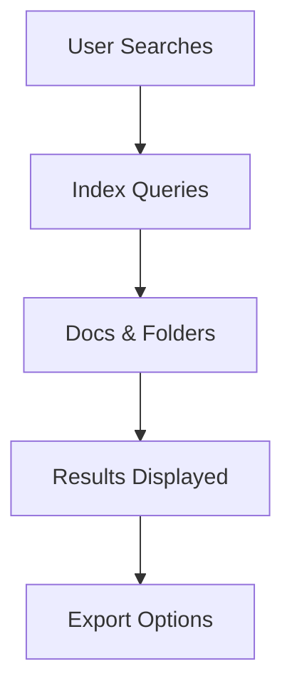

## Overview

Alejandro Albornoz provides a comprehensive documentation space where you organize, edit, and collaborate on project docs. Key capabilities include folder-based organization, rich editing tools, version control, and powerful search with export options.

<Columns cols={2}>
  <Card title="Organize with Folders" icon="folder" href="#document-organization">
    Structure your docs hierarchically for easy navigation.
  </Card>
  <Card title="Rich Editing" icon="edit-3" href="#editing-tools">
    Use Markdown, MDX, or visual editors to create content.
  </Card>
  <Card title="Version History" icon="git-branch" href="#version-control">
    Track changes and revert with built-in version control.
  </Card>
  <Card title="Search & Export" icon="search" href="#search-export">
    Find content quickly and export to various formats.
  </Card>
</Columns>

## Document Organization and Folders

You create folders to group related documents, mimicking your project's structure. Start by creating a root folder for your project, then add subfolders for components, guides, and APIs.

<Steps>
  <Step title="Create a Folder" icon="folder-plus">
    Navigate to the docs sidebar and click the new folder button.
  </Step>
  <Step title="Add Documents" icon="file-plus">
    Drag and drop MDX files or create new ones inside folders.
  </Step>
  <Step title="Reorder Structure" icon="move">
    Use drag-and-drop to rearrange folders and files for optimal navigation.
  </Step>
</Steps>

<Callout kind="tip">
  Use descriptive folder names like `api-reference` or `user-guides` to improve discoverability.
</Callout>

## Editing and Formatting Tools

The platform supports multiple editing modes tailored to your workflow.

<Tabs>
  <Tab title="Markdown Editor" icon="edit">
    Write standard Markdown with live preview.

````markdown
# Welcome

This is **bold** and *italic* text.

- List item 1
- List item 2
````

  </Tab>
  <Tab title="MDX Editor" icon="code">
    Embed JSX components directly in your docs.

````mdx
import { Callout } from 'components';

<Callout kind="info">
  This is an MDX callout.
</Callout>
````

  </Tab>
  <Tab title="Visual Editor" icon="eye">
    Use a WYSIWYG interface for non-technical users. Toggle between source and preview modes seamlessly.
  </Tab>
</Tabs>

## Version Control for Docs

Every change you make is automatically versioned. View history, compare diffs, and restore previous versions without external tools.

<CodeGroup tabs="CLI,API">
  ```bash
  # Fetch version history via CLI
  docs version-history get /path/to/doc.mdx
  ```
  ```javascript
  // API call to retrieve versions
  const versions = await fetch('https://api.example.com/docs/versions?path=/path/to/doc.mdx');
  const data = await versions.json();
  console.log(data);
  ```
</CodeGroup>

<Expandable title="Advanced Version Restore" default-open="false">

To restore a specific version:

1. Select the doc and open version history.
2. Click on the desired commit.
3. Choose "Restore this version".

</Expandable>

## Search and Export Functionalities

Search across all your docs with full-text indexing. Export to PDF, HTML, or ZIP archives for sharing.

| Feature       | Description                          | Supported Formats |
|---------------|--------------------------------------|-------------------|
| Global Search | Query titles, content, and metadata | Instant results  |
| Folder Export | Bulk export entire folders          | PDF, HTML, ZIP   |
| Single Doc    | Export individual pages             | Markdown, PDF    |

<Callout kind="success">
  Pro tip: Use advanced search operators like `filename:api` to filter results precisely.
</Callout>



These features enable you to maintain a living documentation hub for your projects. Start organizing today to streamline collaboration.